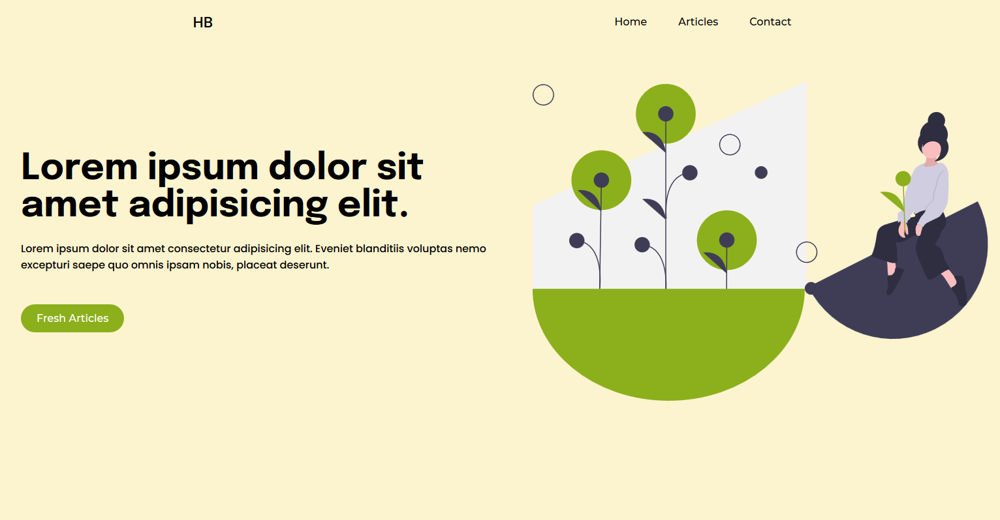
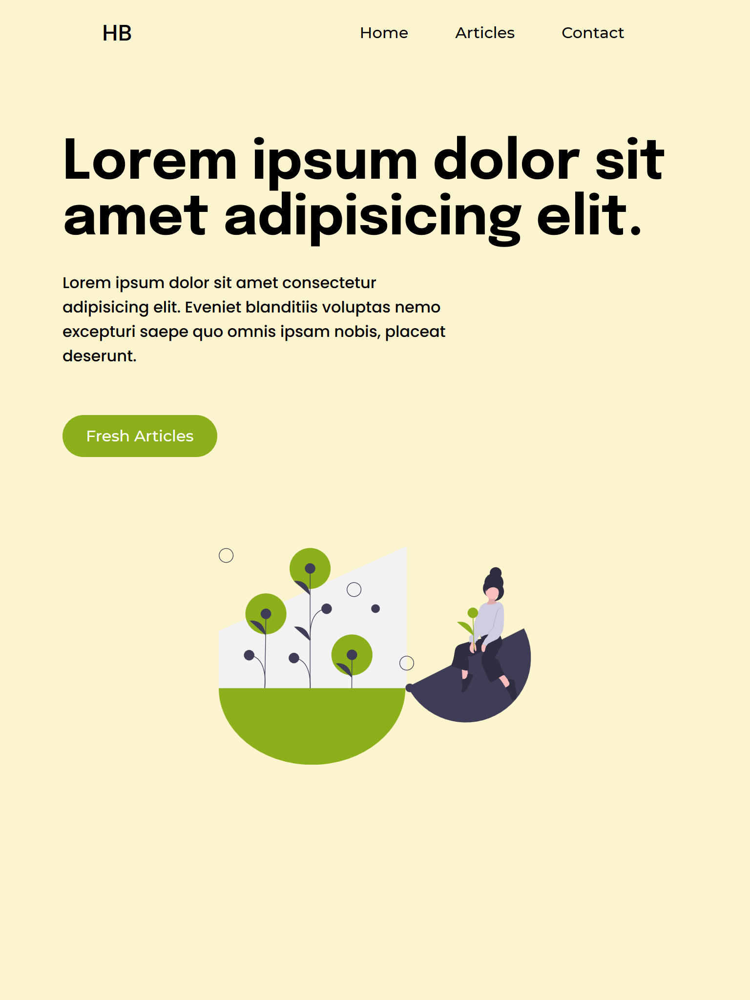

## 🌱 houseplants-blogger

This blog is built using Nextjs, And is still in progress.

## ✅ Demo

## ✅ Install 
- Clone the project.
- Then run `yarn` to install the dependecies.
- After that run `yarn dev` to run the app in 
**development mode**.
- Open [http://localhost:3000](http://localhost:3000) to view it in the browser.
